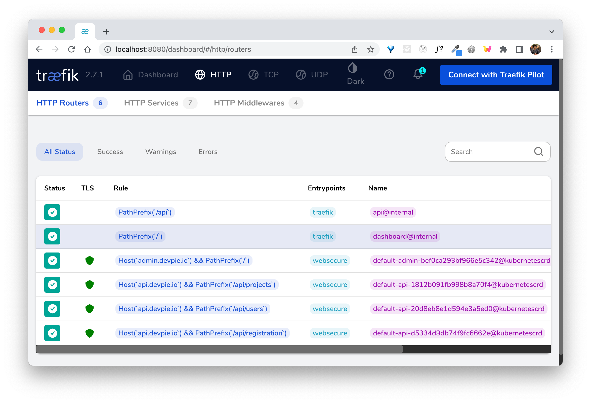

# Setup Guide

## Requirements

Tested on a m1 mac . It should work on linux as well.

- aws account
- install docker-desktop
- install [terraform](https://www.terraform.io/)
- install [go v1.18 or higher](https://go.dev/doc/install)
- install [tilt](https://tilt.dev/)
- install [mkcert](https://github.com/FiloSottile/mkcert)
- install [mockery](https://github.com/vektra/mockery)
- install [pgcli](https://www.pgcli.com/)
- install [golangci-lint](https://github.com/golangci/golangci-lint)
- install [go-migrate](https://github.com/golang-migrate/migrate)
- install [nosql workbench](https://docs.aws.amazon.com/amazondynamodb/latest/developerguide/workbench.settingup.html)
- [saas-infra resources](https://github.com/devpies/saas-infra/tree/main/local/saas)

## Instructions 
1. Enable Kubernetes in docker-desktop.
2. Checkout `saas-infra` and deploy the `local` infrastructure.
   - You will need to supply a valid email for the _SaaS provider admin user_. This user is used to
   login to the admin web app.
   
3. Use terraform output values for this repository's `.env` file.
4. Copy `.env.sample` in the project root and create your own `.env` file.
5. Copy `./manifests/secrets.sample.yaml` and create your own `./manifests/secrets.yaml` file.
6. Generate valid tls self-signed certificates: `mkcert devpie.local "*.devpie.local" localhost 127.0.0.1 ::1`
7. Create the `tls-secret` for traefik with the certificate values: 
   ```
   kubectl create secret generic tls-secret --from-file=tls.crt=./[YOUR-CERT-GOES-HERE] --from-file=tls.key=./[YOUR-KEY-GOES-HERE]
   ```
8. Modify your hosts file:
   ```bash
    ##
    # Host Database
    #
    # localhost is used to configure the loopback interface
    # when the system is booting.  Do not change this entry.
    ##
    127.0.0.1       localhost devpie.local admin.devpie.local api.devpie.local 
    ```
   > __TIP__  
   > 
   > If you still see the "Not Secure" label in the browser you may need to restart the browser 
   > for the changes to take effect.
9. Start containers: `tilt up`
10. Setup local DynamoDB tables: `make dynamodb-create`
    - You should see 3 DynamoDB tables. The only table with data at this point is `auth-info`.   
    
11. Port forward the traefik ports: `make ports`
12. Deploy ingress routes: `make routes`

13. Navigate to http://localhost:8080/dashboard/#/http/routers. You should see `4` tls terminated routers.



## Getting Help
If you need help or have questions create an issue. Alternatively, you can join our [discord server](https://discord.gg/MeKKvHBKQG) 
and reach out there.

## Contributions
If you have ideas on automating this setup feel free to submit a PR. 
